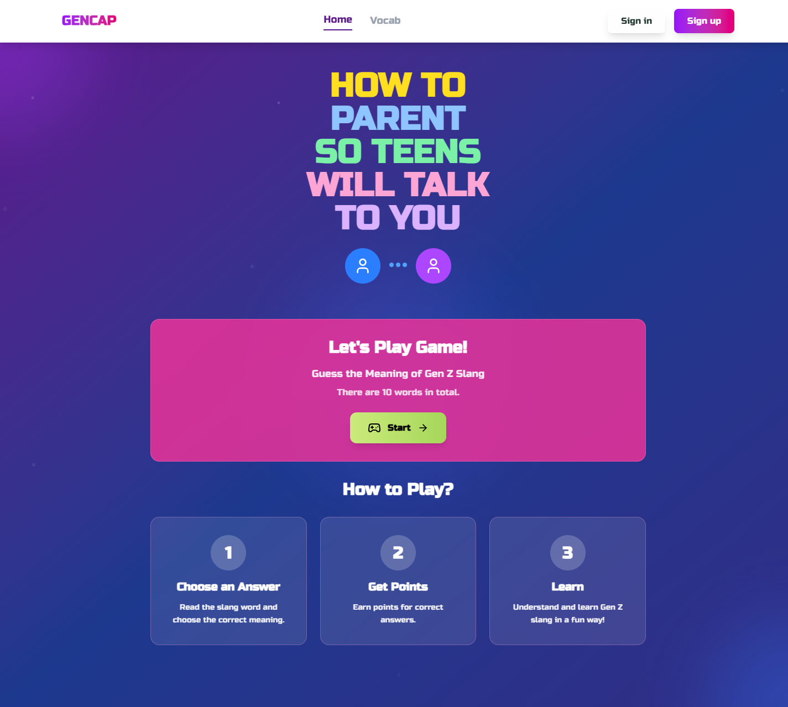
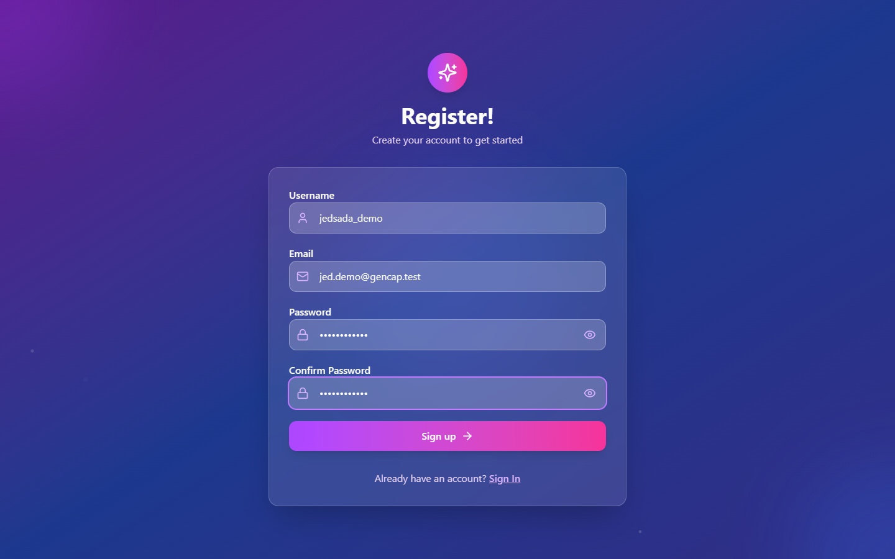
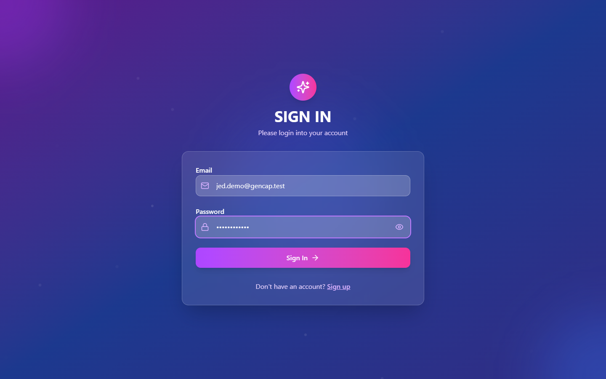
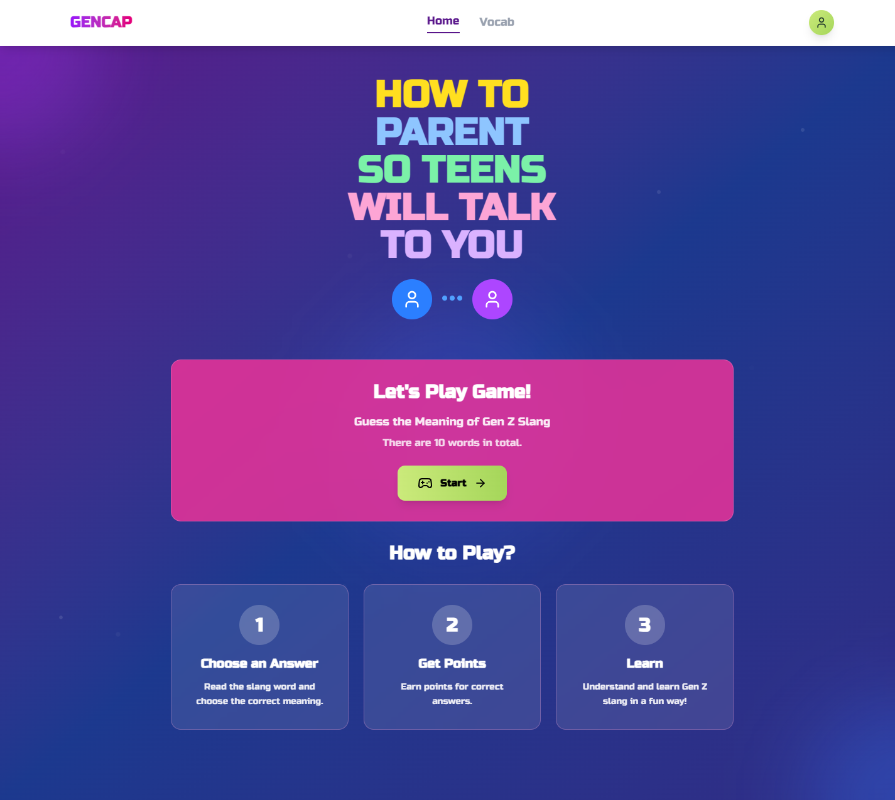
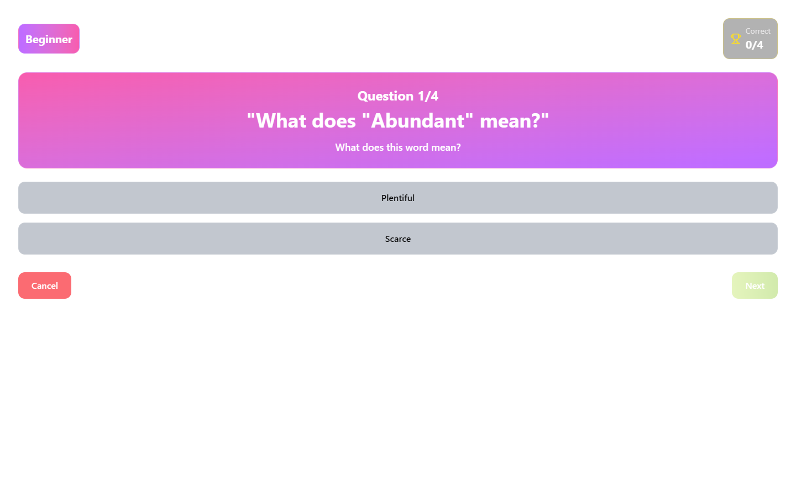
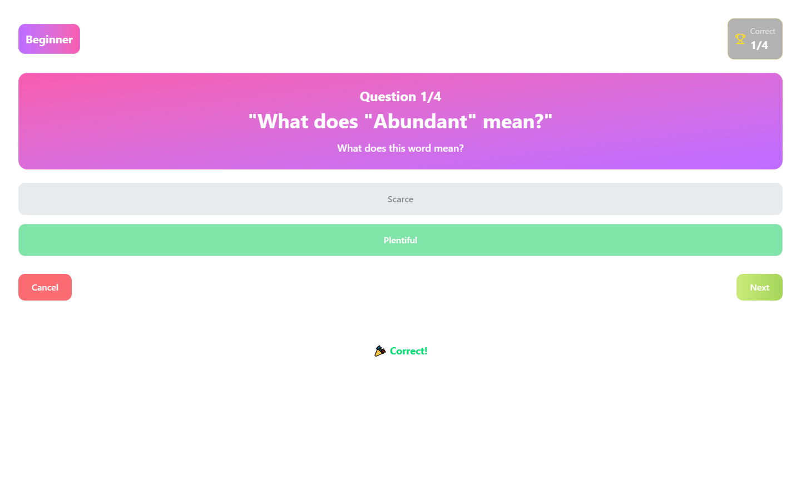
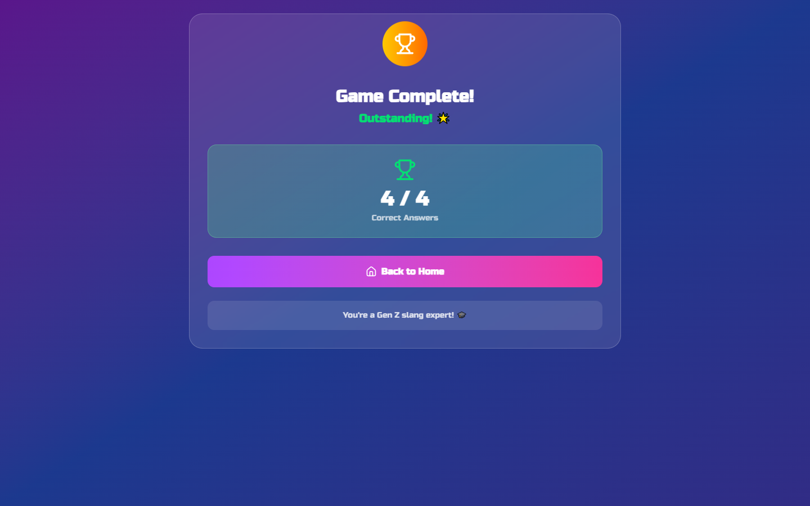

# GENCAP — English Vocabulary Quiz Web App

A gamified vocabulary-learning web app built for the CSC105 hackathon. Users take
multiple-choice exams grouped by difficulty level, and unlock new vocabulary words
as they progress and score points.

Built by Team G07 as part of King Mongkut's University of Technology Thonburi
(KMUTT) coursework.

---

## Features

- 🔐 User authentication (sign up / sign in)
- 📝 Multiple-choice vocabulary exams, grouped by difficulty
- 🔓 Word-unlock progression system — correct answers unlock new vocabulary
- 📊 Per-user exam score tracking

## Tech Stack

**Frontend**
- React 19 + Vite
- Tailwind CSS 4
- React Hook Form
- Axios
- Lucide icons

**Backend**
- Hono
- Prisma ORM + MySQL
- JWT authentication
- bcrypt password hashing

## Project Structure

```
GENCAP/
├── FrontEnd/          # React + Vite client
│   └── src/
│       ├── api/        # API client calls
│       ├── components/
│       ├── contexts/
│       ├── pages/
│       └── utils/
└── BackEnd/            # Hono API server
    ├── prisma/          # Prisma schema & migrations
    └── src/
```

## Data Model (simplified)

- **User** — account + language level, linked to exam scores and unlocked words
- **Exam** — grouped by difficulty, contains questions
- **Question** — linked to a vocabulary word, has multiple choices
- **Choice** — one answer option per question (correct/incorrect)
- **UserExamScore** — tracks each user's score per exam
- **UserVocabUnlock** — tracks which words a user has unlocked

## Getting Started

### Backend

```bash
cd BackEnd
npm install
npx prisma generate
npx prisma migrate dev
npm run dev
```

### Frontend

```bash
cd FrontEnd
npm install
npm run dev
```

## My Role

I worked on the backend: authentication (sign in / sign up with JWT), the exam
scoring flow, and the choice/answer submission logic, alongside CORS setup and
API integration with the frontend team.

## Screenshots

Walkthrough of the exam flow — sign up, sign in, take the multiple-choice quiz, and see the score.

| | |
|---|---|
| **Home page** |  |
| **Sign up** |  |
| **Sign in** |  |
| **Logged in** |  |
| **Exam question** |  |
| **Correct answer feedback** |  |
| **Final question** |  |
| **Result screen** |  |

## About the Project

Built during a CSC105 hackathon at KMUTT as a team project (Team G07). This
project is for academic/portfolio purposes and is not intended for commercial
distribution.
